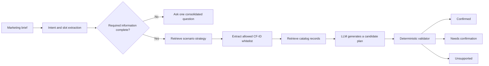

# Architecture

## Design goal

Audience Blueprint is designed to fail closed: semantic retrieval may propose candidates, but deterministic code decides whether a record is allowed to enter the final answer.

## Trust boundaries

### Strategy knowledge

Strategy documents can recommend combinations and explain business intent. They cannot prove a CDP field exists. Each scenario declares an explicit list of allowed internal record IDs.

### Catalog knowledge

Catalog documents describe fields, paths, types, operators, values and evidence metadata. A record without sufficient evidence is downgraded to `NEEDS_CONFIRMATION` even if its status text claims otherwise.

### LLM nodes

LLMs interpret the request and create candidate JSON. Their output is untrusted. A candidate field must appear in both the scenario whitelist and the catalog retrieval result.

### Code nodes

Embedded Python code performs pre-model PII checks, slot normalization, strategy whitelist extraction, catalog intersection, metadata checks and deterministic Markdown rendering.

## Non-goals

- direct CDP database access;
- audience-size calculation;
- automatic segment creation;
- campaign execution;
- arbitrary nested boolean-AST compilation.

These boundaries keep the public template safe to evaluate without access to a production CDP.
