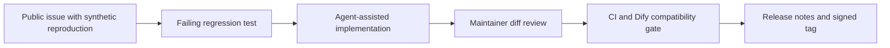

# Maintainer workflow

Audience Blueprint is designed for inspectable, agent-assisted maintenance. AI coding agents may help with implementation, triage, review and release preparation, but a maintainer remains accountable for every merged change.

## Suitable agent tasks

- convert an approved synthetic or redistributable catalog into the public schema;
- add validator tests before changing a workflow boundary;
- compare generated knowledge documents with their catalog source;
- review a pull request for unsupported fields, leaked identifiers and unsafe execution claims;
- reproduce an issue with a minimal synthetic fixture;
- prepare release notes from reviewed commits.

## Required human gates

1. Confirm that every submitted dataset and metadata record can legally be redistributed.
2. Review the exact diff; never merge solely because an agent reports that tests passed.
3. Run `npm run check` on the final commit.
4. Test the imported DSL in a named Dify version before claiming compatibility.
5. Verify examples never imply audience counting, segment creation or campaign delivery.
6. Keep model credentials, Dify knowledge IDs and organization URLs outside the repository.

## Issue-to-release loop

An issue should state the current behavior, expected behavior, minimal fixture and safety impact. A pull request should link the issue, explain the trust-boundary change and include automated evidence.

## Codex usage evidence

If maintainers use Codex, record concrete repository work rather than general claims. Useful evidence includes:

- issue or pull-request links showing triage, implementation or review;
- tests introduced alongside a Codex-assisted fix;
- release notes that point to reviewed changes;
- a documented automation that uses Codex in a core maintenance workflow.

Do not invent adoption numbers, contributor activity or ecosystem importance. Public activity should exist before it is cited in any application.

The current OpenAI program description is available at [Codex for Open Source](https://developers.openai.com/community/codex-for-oss). Program eligibility and benefits are controlled by OpenAI and can change independently of this repository.
